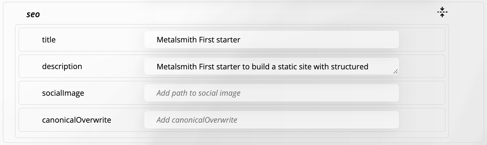
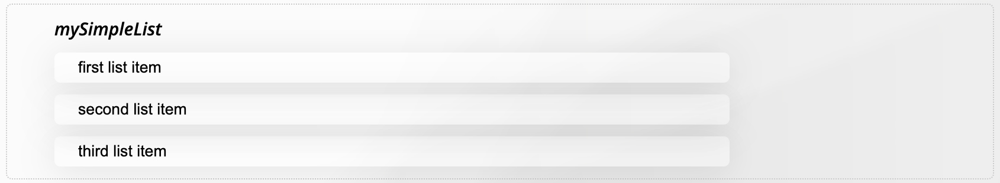
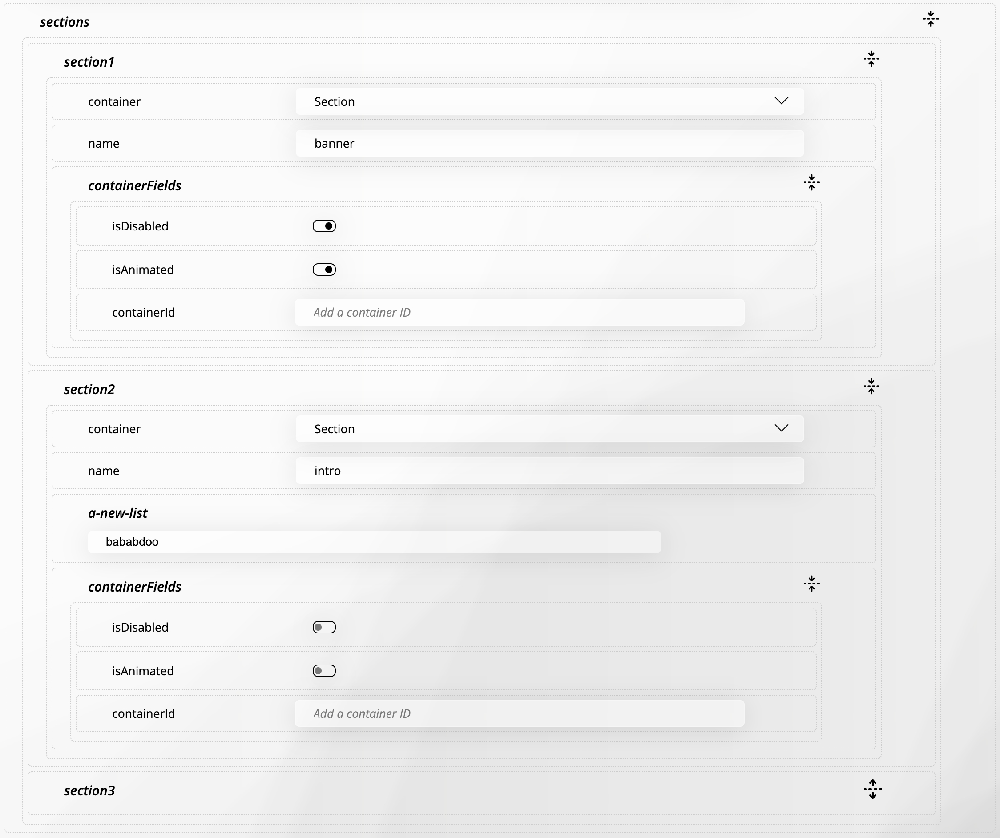

# YAML Frontmatter to the Edit Form Fields - Part 1

The YAML frontmatter defines the structure and metadata of a Markdown file. It’s a block of YAML code placed at the top of the file, traditionally used for setting properties like the title, date, and layout. Everything below the frontmatter forms the file's main content.

In modern web development, especially with modular and component-based architectures, frontmatter can define not only metadata but also the entire structure and content of a page. This makes it possible to compose pages using reusable components. The frontmatter can specify the page layout, which components to use, and their corresponding content.

**Metallurgy** is a tool that provides a visual editor for Markdown files. It allows users to edit both the frontmatter and the file's main content through a form-based interface. The frontmatter YAML is parsed into a form users can easily modify.

However, YAML alone doesn’t carry enough detail to generate a comprehensive form, as it lacks type definitions. For instance, properties are often interpreted as strings, even if they represent dates, numbers, or predefined options.

To address this, an optional schema JSON object can be used alongside the YAML frontmatter. The schema defines expected data types and other validation rules for the YAML properties. Combining both the YAML object and its schema ensures the correct form fields are generated, providing a smoother editing experience.

## The Form

The form is built using the YAML object and its optional schema. Each property in the YAML object is represented as a form field. Fields that represent objects or arrays have a dropzone to support drag-and-drop operations like reordering or adding items.

### A Simple Form Field

Every YAML property maps to a form field. Here’s an example of a simple layout field in the YAML object and its corresponding form field.


**YAML Field**

```yaml
layout: blocks.njk
```

**HTML Form Field**

```html
<div class="label-exists form-element no-drop" draggable="true">
  <span class="sort-handle">...Icon for drag handle...</span>
  <label class="label-wrapper">
    <span>Text Label<sup>*</sup></span>
    <div>
      <input type="text" class="element-label" placeholder="Label Placeholder" readonly="" />
    </div>
  </label>
  <label class="content-wrapper">
    <span class="hint">Text for Text element</span>
    <div>
      <select class="element-value">
        <option value="default.njk">Default</option>
        <option value="sections.njk">Sections</option>
        <option value="blocks.njk">Blocks</option>
      </select>
    </div>
  </label>
  <div class="button-wrapper"></div>
</div>
```

The form field consists of a label, input elements, and interactive controls. The select element is populated with options, and the current value from the YAML object is selected.

### Key Elements of the Field Wrapper

1. **`form-element` Class:**

   - Base class for all form elements.

2. **`draggable="true"` Attribute:**

   - Allows the field to be dragged.

3. **`no-drop` Class:**

   - Prevents items from being dropped onto the field.

4. **`label-exists` Class:**

   - Indicates the field has an existing label, typical when reading a valid YAML object.

5. **`label-wrapper` Class:**

   - Contains the label (field key).
   - If the label exists, it’s displayed and the input field is read-only.
   - If the field is empty, the input is editable, showing the placeholder "_Text Label_."

6. **`content-wrapper` Class:**

   - Contains the field’s value.
   - If empty, the `.hint` element is displayed.
   - In this example, the value is represented by a `select` element.

7. **`button-wrapper` Class:**
   - Holds optional action buttons, added dynamically based on the field type and schema.
   - Buttons may include actions like delete or duplicate.

This structure ensures a flexible and interactive form system that can be tailored to various YAML configurations.

### An Object Field

Fields that represent objects have a dropzone to support drag-and-drop operations. Here’s an example of an object field in the YAML object and its corresponding form field.



**YAML Field**

```yaml
seo:
  title: Metalsmith First starter
  description: Metalsmith First starter to build ...
  socialImage: ''
  canonicalOverwrite: ''
```

**HTML Form Field**

```html
<div class="label-exists form-element is-object no-drop" draggable="true">
  <span class="sort-handle">...Icon for drag handle...</span>
  <label class="object-name label-wrapper label-exists">
    <span>Object Label<sup>*</sup></span>
    <span class="hint">Sections Object</span>
    <input type="text" class="element-label" placeholder="Label Placeholder" readonly="" />
    <span class="collapse-icon">...Icons for collapsing the object dropzone..</span>
  </label>
  <div class="object-dropzone dropzone js-dropzone" data-wrapper="is-object">
    <div class="label-exists form-element no-drop" draggable="true">
      <span class="sort-handle">...Icon for drag handle...</span>
      <label class="label-wrapper">
        <span>Text Label<sup>*</sup></span>
        <div>
          <input type="text" class="element-label" placeholder="Label Placeholder" readonly="" />
        </div>
      </label>
      <label class="content-wrapper">
        <span class="hint">Text for Text element</span>
        <div>
          <input type="text" class="element-value" placeholder="Add a title" />
        </div>
      </label>
      <div class="button-wrapper"></div>
    </div>
    <div class="label-exists form-element no-drop" draggable="true">
      <span class="sort-handle">...Icon for drag handle...</span>
      <label class="label-wrapper">
        <span>Text Label<sup>*</sup></span>
        <div>
          <input type="text" class="element-label" placeholder="Label Placeholder" readonly="" />
        </div>
      </label>
      <label class="content-wrapper">
        <span class="hint">Text for Text element</span>
        <div>
          <textarea class="element-value is-editor" placeholder="Click to open editor">
Metalsmith First starter to build...</textarea
          >
        </div>
      </label>
      <div class="button-wrapper"></div>
    </div>
    <div class="label-exists form-element no-drop" draggable="true">...Social Image Field...</div>
    <div class="label-exists form-element no-drop" draggable="true">...Canonical URL Field...</div>
  </div>
</div>
```

This form field represents an object with multiple properties. Each property is represented as a separate form field within the object dropzone. The object dropzone allows users to reorder or add new properties.

The object form field is very similar to a simple form field, but instead of a `content-wrapper`, it includes a dropzone for the object's fields. Each field within the object dropzone is a simple form field, repeating the structure we discussed above.

### A Simple List Field

A simple list is a field that represents an array of simple string values. Here’s an example of a simple list field in the YAML object and its corresponding form field.



**YAML Field**

```yaml
mySimpleList:
  - first list item
  - second list item
  - third list item
```

**HTML Form Field**

```html
<div class="label-exists form-element is-list no-drop draggable-transition" draggable="true">
  <span class="sort-handle">...Icon for drag handle...</span>
  <label class="label-wrapper object-name">
    <span>List Label<sup>*</sup></span>
    <input type="text" class="element-label" placeholder="Label Placeholder" readonly="" />
  </label>
  <ul>
    <li>
      <input type="text" class="list-item" placeholder="Item Placeholder" />
      <div class="button-wrapper">...Icons for add/delete buttons...</div>
    </li>
    <li>
      <input type="text" class="list-item" placeholder="Item Placeholder" />
      <div class="button-wrapper">...Icons for add/delete buttons...</div>
    </li>
    <li>
      <input type="text" class="list-item" placeholder="Item Placeholder" />
      <div class="button-wrapper">...Icons for add/delete buttons...</div>
    </li>
  </ul>
  <div class="button-wrapper">...Icons for add/delete buttons...</div>
</div>
```

The form field for a simple list consists of a label, an unordered list (`ul`), and list items (`li`). Each list item contains an input field for the list item value and a button wrapper for actions like adding or deleting the item.

### The Section Array Field

A section array is a field that represents an array of page section objects. Here’s an example of a section array field in the YAML object and its corresponding form field.



**YAML Field**

```yaml
sections:
  - container: section
    name: banner
    containerFields:
      isDisabled: true
      isAnimated: true
      containerId: ''
  - container: section
    name: intro
    a-new-list:
      - bababdoo
    containerFields:
      isDisabled: false
      isAnimated: false
      containerId: ''
  - container: section
    name: another
    containerFields:
      isDisabled: false
      isAnimated: false
      containerId: anIDID
```

**HTML Form Field**

```html
<div class="form-element is-array no-drop label-exists" draggable="true">
  <span class="sort-handle">...Icon for drag handle...</span>
  <label class="object-name label-wrapper">
    <span>Array Label<sup>*</sup></span>
    <input type="text" class="element-label" placeholder="Array Name" readonly="" />
    <span class="collapse-icon">...Icons for collapsing the object dropzone..</span>
  </label>

  <div class="array-dropzone dropzone js-dropzone" data-wrapper="is-array">
    <div class="label-exists form-element is-object no-drop" draggable="true">
      <span class="sort-handle">...Icon for drag handle...</span>
      <label class="object-name label-wrapper label-exists">
        <span>Object Label<sup>*</sup></span>
        <span class="hint">Sections Object</span>
        <input type="text" class="element-label" placeholder="Label Placeholder" readonly="" />
        <span class="collapse-icon">...Icons for collapsing the object dropzone...</span>
      </label>
      <div class="object-dropzone dropzone js-dropzone" data-wrapper="is-object">
        <div class="label-exists form-element no-drop" draggable="true">
          ...container selection...
        </div>
        <div class="label-exists form-element no-drop" draggable="true">...name input</div>
        <div class="label-exists form-element is-object no-drop" draggable="true">
          ...containerFields...
        </div>
      </div>
    </div>

    <div class="label-exists form-element is-object no-drop" draggable="true">...section 2...</div>

    <div class="label-exists form-element is-object no-drop" draggable="true">...section 3...</div>
  </div>
</div>
```

All the fields are rendered in a predictable and consistent manner, a requirement for later converting the form back into a YAML object.

Now that we have a clear understanding of how YAML frontmatter is represented in a form, we can review how we build a field from a YAML object and its schema.
